# Task Board — Cross-Platform Take-Home

A small task board built with **one React Native codebase** that runs on a
phone and on a desktop, and genuinely changes shape between them.

Add tasks, complete them, delete them, filter All / Active / Completed. Data
persists locally between restarts.

| | |
|---|---|
| **Framework** | React Native 0.86.2 (TypeScript) |
| **Platform targets run** | iOS (simulator, native build) · macOS desktop (Electron + react-native-web) |
| **Persistence** | AsyncStorage on iOS · `localStorage` on desktop — both behind one interface |
| **Tests** | 82 passing (`npm test`) |

---

## 1. Before you start

You need **Node 22.11.0 or newer** — React Native 0.86 will not run on older
versions. The repo ships an `.nvmrc`, so:

```bash
nvm use
```

If you don't have that version yet: `nvm install 22.11.0`.

The app lives in `frontend/`, so install its dependencies there:

```bash
cd frontend
npm install
```

> Every command in sections 2, 3 and 5 runs from `frontend/`.
> Section 4 (the API) runs from `server/`.

---

## 2. Run it on the desktop  ⏱ ~30 seconds

This is the quickest way to see the app.

```bash
cd frontend && npm run desktop
```

A real Electron window opens. **Drag its edge to make it narrow** — the layout
switches from the three-pane desktop view to the phone view live, because it
reacts to window size rather than to which OS it's on.

> The window's minimum width is deliberately set to 360px so you can drag it
> all the way down to phone width.

### Want an actual installable app instead?

```bash
cd frontend && npm run desktop:build
```

This writes a `.dmg` installer into `frontend/release/`. (On Windows it produces an
`.exe` installer, on Linux an AppImage — same command.)

---

## 3. Run it on iOS  ⏱ ~5–10 minutes the first time

Requires Xcode. Install the native dependencies once:

```bash
cd frontend/ios && pod install && cd ..
```

Then build and run (from `frontend/`):

```bash
npm run ios
```

That opens the iPhone simulator and installs the app.

### If it shows a red "Unable to resolve module" screen

That means something else on your machine is already using port **8081** (the
Metro bundler's default) — commonly another React Native or Expo project. Your
app connects to the wrong server. Two ways out:

**Option A — build a self-contained app (no bundler needed):**

```bash
cd frontend && npm run ios -- --mode Release
```

The JavaScript is bundled into the app, so it doesn't need Metro at all. This
is what the screenshots below were taken from.

**Option B — free port 8081** by stopping the other project, then `npm run ios`.

### Android

An Android project is included and the code is platform-agnostic, but **I did
not run or verify Android** — the two targets I actually ran are iOS and the
desktop. `npm run android` is there if you want to try it.

---

## 4. The optional local API (Docker)  ⏱ ~1 minute

**You do not need this to run the app.** By default everything is stored
locally on the device, exactly as the brief allows.

This exists to show that swapping local storage for a real backend is a
one-line change, not a rewrite.

### Step 1 — start the API

Make sure Docker Desktop is running, then:

```bash
cd server && docker compose up -d --build
```

Check it's alive:

```bash
curl http://localhost:4000/health
```

You should see `{"status":"ok","tasks":0}`.

### Step 2 — point the app at it

From `frontend/`, run either target with one environment variable:

```bash
TASKBOARD_DATA_SOURCE=http npm run desktop
```

```bash
TASKBOARD_DATA_SOURCE=http npm run ios
```

The app now reads and writes over HTTP instead of local storage. **No app code
changes** — the switch happens in `frontend/src/app/services/createServices.ts`, which
picks a different implementation of the same `TaskRepository` interface.

Here it is working. Both tasks below were created **only** through the
container (with `curl`), and local storage was cleared before the screenshot —
so everything on screen came over HTTP:

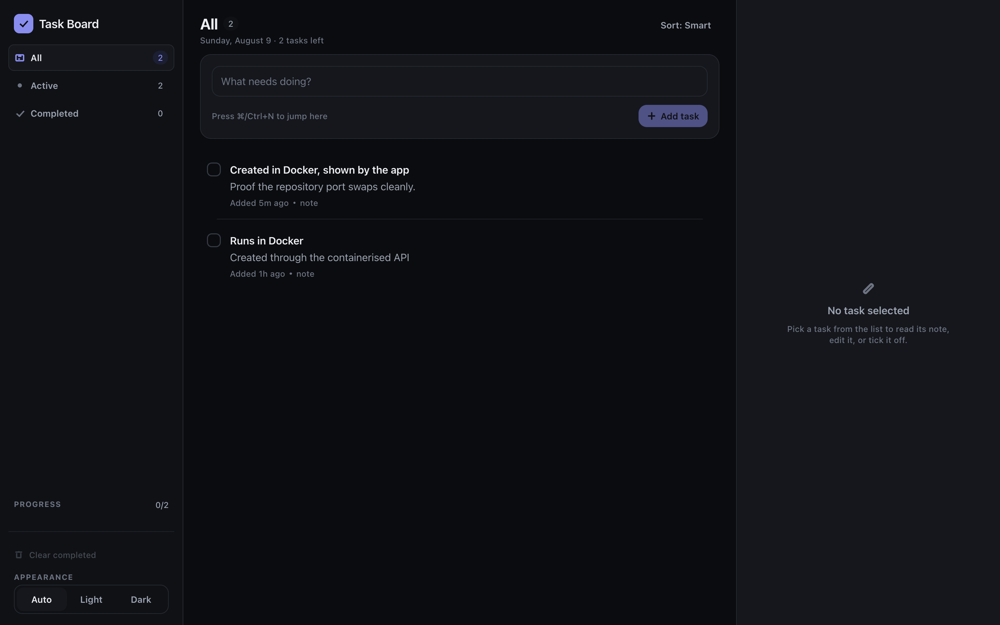

> Use `npm run desktop` (the dev-server flow) for API mode. The *packaged* app
> loads from a `file://` origin, and Chromium blocks cross-origin requests from
> there regardless of CORS headers — so the packaged build is local-storage
> only.

### Step 3 — stop it when you're done

```bash
cd server && docker compose down
```

### No Docker? Run it with plain Node

```bash
cd server && npm start
```

Same API, same port. Task data is written to `server/data/tasks.json`.

### What the API supports

| Method | Path | Purpose |
|---|---|---|
| `GET` | `/health` | Liveness check |
| `GET` | `/tasks` | List every task |
| `POST` | `/tasks` | Create — `{ "title": "…", "note": "…" }` |
| `PATCH` | `/tasks/:id` | Update title, note, or completion |
| `DELETE` | `/tasks/:id` | Delete one |
| `DELETE` | `/tasks?filter=completed` | Delete all completed |

It's a zero-dependency Node server (`server/server.js`) — the point was to
prove the seam, not to showcase a framework.

---

## 5. Tests and checks

```bash
cd frontend
npm test          # 82 tests
npm run typecheck # TypeScript, no errors
npm run verify    # typecheck + lint + tests together
```

What's covered:

- **Filter, sort and validation rules** — pure functions, no rendering needed.
- **Repository behaviour** — persistence, concurrent writes, and recovery from
  a corrupt storage payload.
- **Optimistic updates** — a failing write rolls the UI back.
- **The add / complete / delete flow** — driven through the real UI.
- **Responsive layout** — the app is rendered at phone, tablet and desktop
  widths, asserting the layout actually changes shape at each one.

---

## 6. Screenshots

All taken from the running app: iOS from the simulator, desktop from the
Electron window.

### iOS — iPhone 17 Pro (iOS 26.1)

| List | Task detail | New task |
|---|---|---|
| 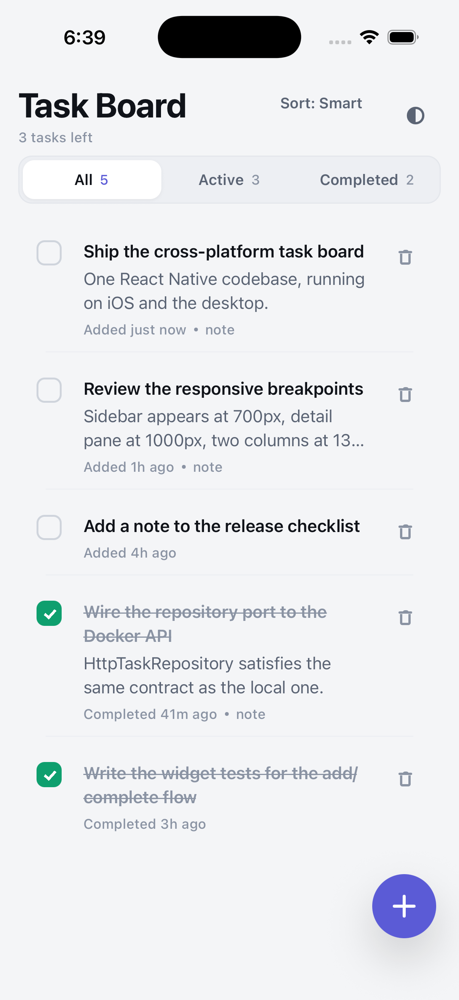 | 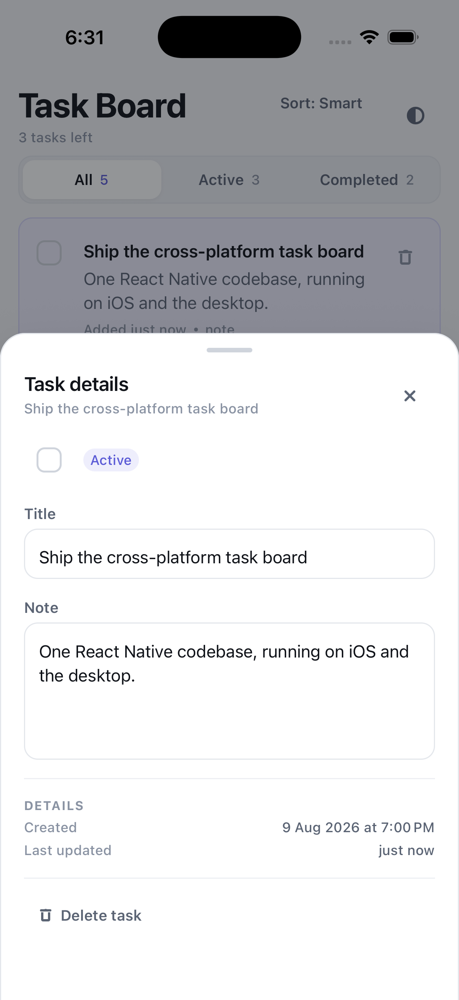 | 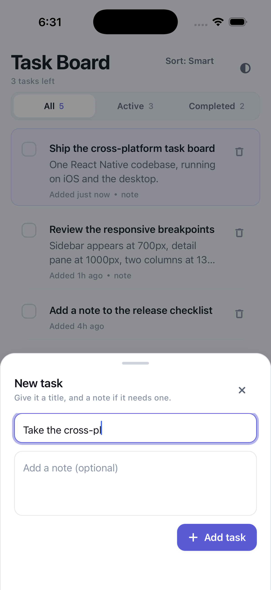 |

| Active filter | Dark mode |
|---|---|
| 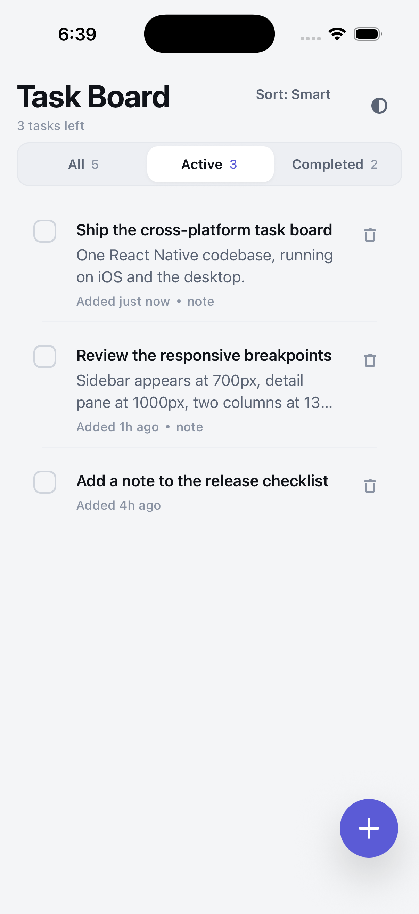 | 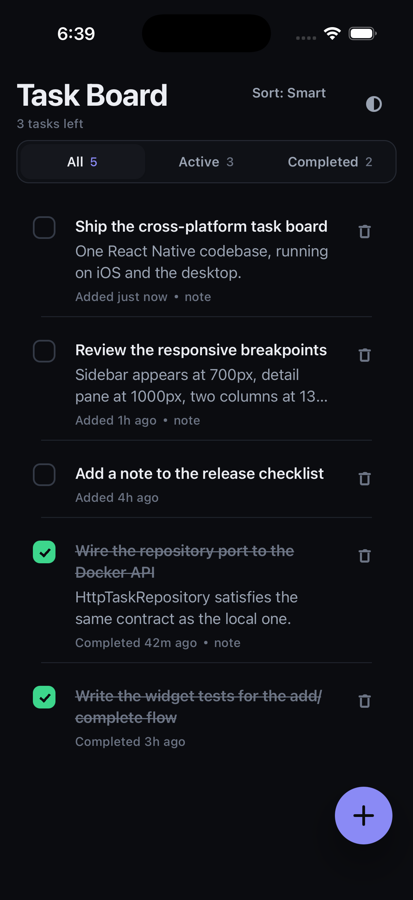 |

### Desktop — Electron

Three panes at full width: filter rail, task list, task detail.

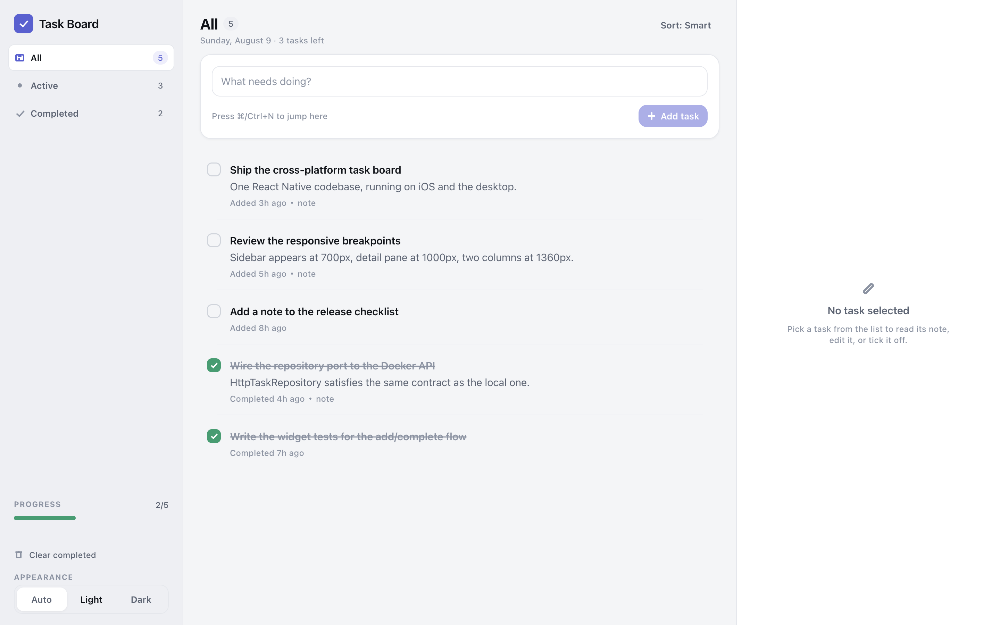

Dark mode:

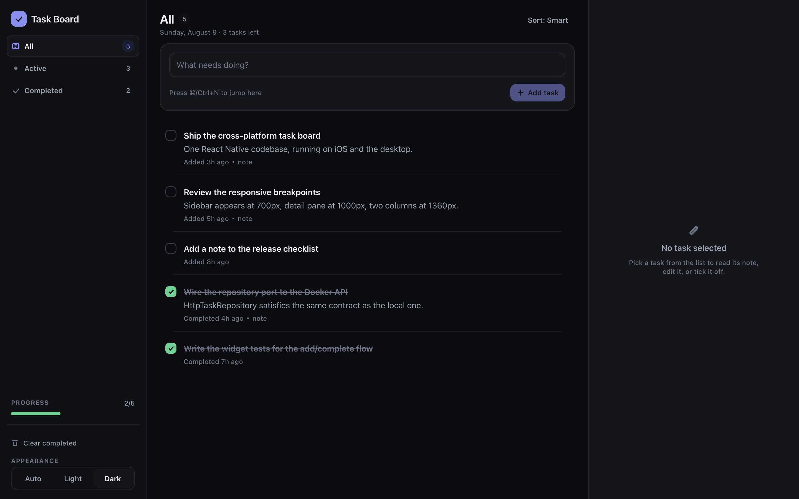

**The same desktop app, resized.** At medium width the detail pane folds away
and the rail stays; at phone width it becomes the phone layout, with the
segmented filter and floating add button:

| Medium window | Narrow window |
|---|---|
| 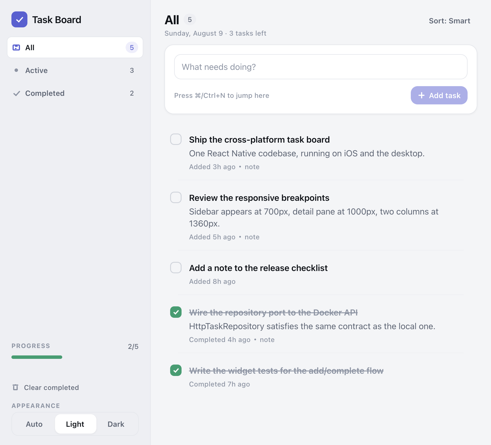 | 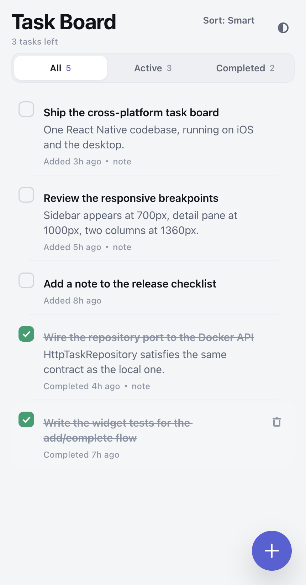 |

Wide enough, and the list becomes a two-column grid:

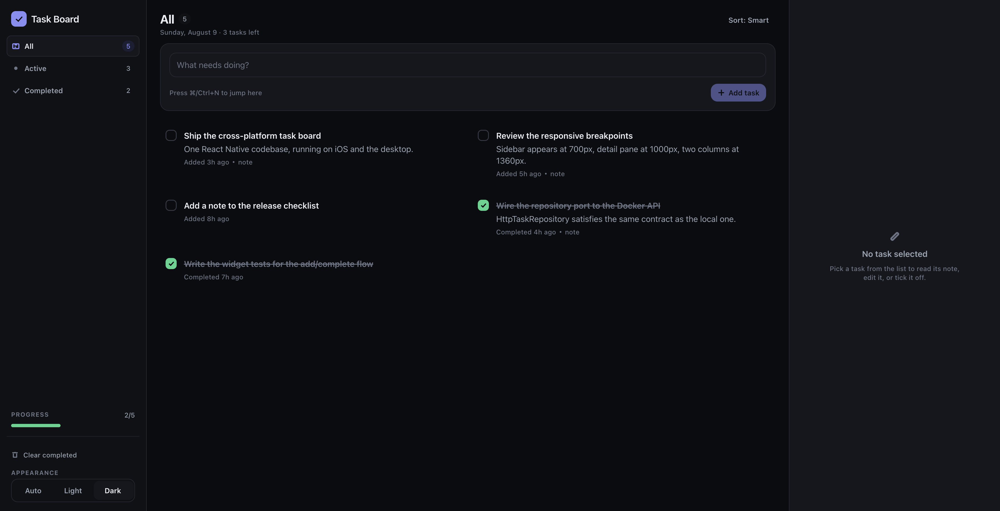

> Reproduce them yourself, from `frontend/`:
> `npm run web:build && npx electron scripts/capture-desktop.js`, and
> `node scripts/seed-ios-simulator.js` to put the same sample board on a
> booted simulator.

---

## 7. How the cross-platform part actually works

This is the part the brief cares about, so here is the short version. There's a
longer walkthrough in [docs/ARCHITECTURE.md](docs/ARCHITECTURE.md).

### The layout responds to size, not to the operating system

There is no `if (Platform.OS === 'ios')` anywhere in the layout code. One hook,
`useResponsive`, reads the live window size and answers questions like *"is
there room for a sidebar?"*:

| Width | Layout | What you get |
|---|---|---|
| `< 700px` | Stack | One column, filter tabs, floating add button, bottom sheets |
| `700–999px` | Split | Persistent filter rail + list; detail opens as a sheet |
| `≥ 1000px` | Triptych | Rail + list + detail pane, all visible at once |
| `≥ 1360px` | + grid | List becomes two columns *if the list pane itself is wide enough* |

Because it reads live window dimensions, an iPad rotating and a desktop window
being dragged take the identical code path.

Hover states and hit targets follow the **input device**, not the platform:
44pt touch targets where there's a finger, tighter 32pt ones where there's a
mouse. The delete button hides until you hover on desktop, and is always
visible on touch, where there is no hover.

### One codebase, with the platform split pushed to the edge

The only per-platform files in the entire project are two **storage adapters**
and a keyboard-shortcut hook:

```
keyValueStore.ts       → AsyncStorage   (iOS / Android)
keyValueStore.web.ts   → localStorage   (desktop)
```

Everything above that line — the domain rules, the repository, the store, every
screen and component — is byte-identical on both targets. The bundler picks the
right file by extension; nothing in the app branches on platform.

### Swapping storage for an API is one line

The app talks to a `TaskRepository` interface. Three implementations satisfy
it: local storage, HTTP, and in-memory (used by tests). Which one gets built is
decided in a single place, `createServices.ts` — that's the whole reason
section 4 above works without touching app code.

---

## 8. Project structure

The repository holds two independent projects side by side, each with its own
`package.json` and its own lifecycle:

```
taskboard/
├── README.md            You are here.
├── docs/                Architecture notes and screenshots.
│
├── frontend/            The app — iOS, Android and desktop.
│   ├── src/             ← see below
│   ├── ios/  android/   Native projects.
│   ├── electron/        Desktop shell (main + preload process).
│   ├── scripts/         Screenshot capture and simulator seeding.
│   ├── __tests__/       Test suites.
│   └── package.json
│
└── server/              Optional Dockerised API (section 4).
    ├── server.js        Zero-dependency Node service.
    ├── Dockerfile
    └── package.json
```

They are deliberately *not* wired together with workspaces: the server shares
no code with the app, so a plain folder split gives the same separation with
none of the monorepo tooling.

Inside `frontend/src`:

```
src/
├── domain/          Business rules. Plain TypeScript — no React, no I/O.
│                    Task model, filtering, sorting, the repository interface.
├── data/            Adapters: storage drivers, mappers, the three repositories.
├── features/tasks/  The feature: store, components, and the two layouts.
├── design-system/   Theme tokens, light/dark palettes, UI primitives.
├── responsive/      Breakpoints and the hook that drives layout from size.
├── shared/          Small cross-cutting utilities.
└── app/             Composition root: wires everything together.
```

Dependencies point inwards: `features` and `data` both depend on `domain`, and
`domain` depends on nothing — not even React. That's what keeps the business
rules testable without a simulator and identical across platforms.

---

## 9. Assumptions and shortcuts

Worth being upfront about:

- **Desktop = Electron + react-native-web.** `react-native-macos` only supports
  React Native up to 0.81, and this is 0.86 — so a native macOS fork wasn't
  available. Electron gives a real, resizable desktop window and an installable
  package from the same source tree.
- **Android is untested.** The project is there and the code is
  platform-agnostic, but I ran iOS and desktop, so those are what I can vouch
  for.
- **No task ordering by hand, no due dates, no categories.** The brief said
  "nothing exotic" and I took that seriously; the effort went into the layout,
  the architecture and the tests instead.
- **Editing a task** happens in the detail view (pane on desktop, sheet on
  phone) rather than inline in the list.
- **The screenshots are seeded** with a fixed sample board so the iOS and
  desktop shots show identical content and the comparison is purely about
  layout. The seeding scripts are in `frontend/scripts/`.

---

## 10. Bonuses attempted

| Bonus | Status |
|---|---|
| Dark mode | ✅ Full light/dark themes, plus an "Auto" mode that follows the OS |
| Widget tests for filter + add/complete | ✅ 82 tests, including UI tests at three window sizes |
| Offline-friendly repository layer | ✅ The `TaskRepository` port — swapping to an API is one line |
| Local API instead of local storage, Dockerised | ✅ `server/` — zero-dependency Node API, Dockerfile + compose |
| Installable desktop build | ✅ `npm run desktop:build` produces a `.dmg` |
| Native iOS build | ✅ Runs on the iPhone 17 Pro simulator |
